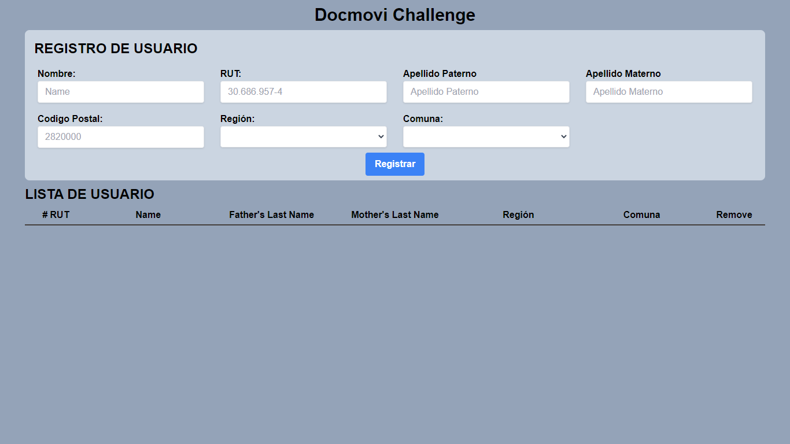

## Prueba Técnica [Full-Stack Trainee Developer]

#### Objetivo General

En esta prueba técnica evaluamos **capacidad de aprendizaje, estilo de código, buenas practicas de desarrollo** y creatividad.

La prueba consiste en crear una aplicación con el framework [Meteor](https://www.meteor.com) la cual debe tener la siguiente funcionalidad.
Altamente recomendado guiarse por el [siguiente tutorial de Meteor y React](https://react-tutorial.meteor.com/), la clave es traducir la funcionalidad explicada en el tutorial y adaptarlo a los requerimientos a continuación:

1.  Pantalla con formulario de creación de pacientes, los datos a validar son nombres, apellido paterno, apellido materno, RUT (validar con librería [RUTlib](https://github.com/RUTlib/rutlib-js)) , Región y comuna de residencia ([utilizando este JSON](https://gist.github.com/juanbrujo/0fd2f4d126b3ce5a95a7dd1f28b3d8dd)) y código postal.
    El componente debe ser creado usando React y es recomendado usar librería para manejo de formularios [react-hook-form](https://github.com/react-hook-form/react-hook-form). Guardar datos recogidos anteriormente en una coleccion MongoDB usando funcionalidad de Meteor.
2.  Al seleccionar una región (dropdown) se deben desplegar las comunas (dropdown) de dicha región
3.  Pantalla de despliegue de todos los pacientes en base de datos. Se debe mostrar una tabla de pacientes desplegando la información recogida en el punto 1. Una fila por paciente
4.  Crear UI usando algun framework de componentes de UI. Recomendado [Tailwind](https://tailwindcss.com/) pero es de libre elección, sugerencia usar el que domines mejor.

Opcional (Esto no es necesario, pero suma mucho) 2. Utilizar typescript

El punto 1 y 2 deben estar en una misma pantalla. Sugerencia: formulario de creación de pacientes en la parte superior de la pantalla y la tabla en la parte inferior. Al crear un nuevo paciente se debe limpiar el formulario y mostrar en tiempo real el nuevo paciente agregado a la colección.

Al terminar crear un repositorio publico en github y enviar link por email a felipevergara@docmovi.com para posterior revisión con el asunto **Prueba técnica JS [Trainee 2022]**.

Despúes de tu entrega se te contactará vía email dentro de los proximos 2 días hábiles (usualmente es antes) para coordinar una entrevista

#### Deadline: Domingo 27 de Noviembre del 2022 | 23:59 hora de chile (GMT-3)

Buena suerte!

---

  

<strong>Dependencias Utilizadas:</strong>
 

* **Meteor js**
* * **useForm**
* * **RUTlib**
* **Tailwind CSS**

## Authors

* **Federico Rampi**
